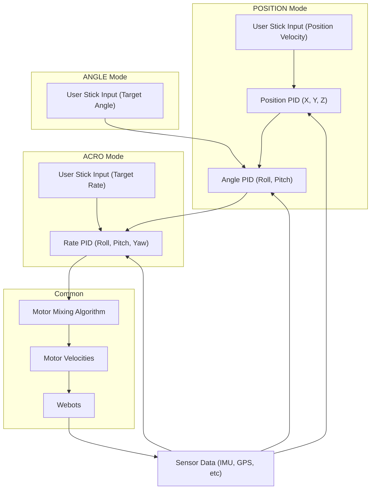

# Webots Drone Flight Controller

A comprehensive drone flight control system (FCS) implemented in Python for the Webots simulator. This project features a  cascaded PID control architecture, multiple flight modes, a full-featured Primary Flight Display (PFD), and real-time diagnostic plots for performance tuning.

---

## Table of Contents
- [Core Features](#core-features)
- [System Architecture](#system-architecture)
  - [Control Flow](#control-flow)
  - [Cascaded PID Control](#cascaded-pid-control)
- [Flight Modes](#flight-modes)
- [Gamepad Controls](#gamepad-controls)
- [Getting Started](#getting-started)
  - [Prerequisites](#prerequisites)
  - [Installation & Running](#installation--running)
- [Configuration & Tuning](#configuration--tuning)
- [Code Structure](#code-structure)
- [License](#license)

---

## Core Features

* **Advanced Flight Control**: A cascaded PID control system for stable and responsive flight.
* **Multiple Flight Modes**: Switch between three distinct flight modes for different flying experiences:
    * `POSITION`: GPS-based position and altitude hold.
    * `ANGLE`: Auto-leveling mode where sticks control the drone's angle.
    * `ACRO`: Rate-based mode for aerobatics and expert control.
* **Primary Flight Display (PFD)**: A rich, real-time visual display showing:
    * Attitude indicator (artificial horizon).
    * Altitude, speed, and vertical speed tapes.
    * Heading tape with cardinal directions.
    * Flight mode annunciator.
    * GPS coordinates and setpoints.
    * Live motor thrust levels.
    * Stick input indicators.
* **Real-time Diagnostic Plots**: Seven live-updating graphs to monitor and tune controller performance, plotting target vs. actual values for angles, rates, and altitude.
* **Gamepad Integration**: Full flight control using a standard gamepad (Mode 2 mapping).
* **External Configuration**: All physical parameters, PID gains, and control limits are defined in an external `config.json` file, allowing for easy tuning without modifying the code.

---

## System Architecture

This project uses a modular architecture to separate concerns between user input, control logic, and data display.

### Control Flow

The high-level data flow is managed in `main.py` and proceeds as follows:

1. **Input**: The `GamepadManager` reads raw axis and button states from the connected joystick.
2. **Sensor Reading**: The main loop polls the Webots sensors (IMU, GPS, Gyro, etc.) for the current state of the drone.
3. **Control Computation**: The `DroneController` takes the latest sensor data and user commands to compute the required motor velocities through its cascaded control loops.
4. **Actuation**: The computed velocities are sent to the four motor actuators in the Webots simulation.
5. **Display**: The `DisplayManager` uses the sensor data and control targets to render the PFD and diagnostic plots.

### Cascaded PID Control

The core of the flight controller is a cascaded PID system. The output of an outer-loop controller serves as the setpoint for a faster, inner-loop controller. This provides robust and stable control.



---

## Flight Modes

You can cycle through flight modes by pressing the 'A' button on the gamepad.

| Mode     | Description                                                                                       | Use Case                                            |
|----------|---------------------------------------------------------------------------------------------------|-----------------------------------------------------|
| POSITION | Fully assisted, GPS-based flight. Drone holds its position when sticks are centered.              | Beginners, autonomous-style flight, stable shots.   |
| ANGLE    | Auto-leveling mode. Sticks control the target roll and pitch angle.                               | Intermediate flyers, FPV-style cruising.            |
| ACRO     | Expert mode. Sticks directly control the rate of rotation. No auto-leveling.                      | Advanced pilots, racing, and aerobatics.            |

---

## Gamepad Controls

| Control           | Gamepad Action             | Description                                      |
|------------------|----------------------------|--------------------------------------------------|
| Roll             | Right Stick (Left/Right)   | Rolls the drone left or right.                  |
| Pitch            | Right Stick (Up/Down)      | Pitches the drone forward or backward.          |
| Yaw              | Left Stick (Left/Right)    | Rotates the drone left or right.                |
| Throttle/Altitude| Left Stick (Up/Down)       | Controls thrust or altitude.                    |
| Switch Mode      | A Button                   | Cycles through POSITION -> ANGLE -> ACRO.       |
| Reset Simulation | Start Button               | Resets the simulation and controller state.     |

---

## Getting Started

### Prerequisites

- **Webots Robot Simulator**: Download and install from the official website.
- **Python 3.8+**
- **Gamepad**: USB or Bluetooth joystick.
- **Python Packages**:
```bash
pip install pygame
```

### Installation & Running

```bash
git clone https://github.com/cristian1928/Webots-Quadrotor-Simulator.git
cd Webots-Quadrotor-Simulator
```

1. Open Webots and navigate to the project directory.
2. Select the `.wbt` file to launch the simulation.
3. Connect your gamepad and press the "Run" button.

---

## Configuration & Tuning

Key settings can be modified in `config.json`:

- `physical_constants`: Drone mass and gravity.
- `drone_geometry`: Motor distances.
- `motor_performance`: Thrust, torque coefficients, max speed.
- `control_limits`: Input caps like max tilt or rotation rate.
- `pid_gains`: Proportional (`Kp`), Integral (`Ki`), and Derivative (`Kd`) for all controllers.

### Tuning Workflow

1. Run simulation and observe.
2. Use plots to identify issues.
3. Edit `config.json` as needed.
4. Restart the simulation.

---

## Code Structure

| File              | Description                                                             |
|------------------|-------------------------------------------------------------------------|
| `main.py`         | Simulation entry point. Handles loop, sensors, controllers.             |
| `drone_controller.py` | Main flight control logic, including cascaded PIDs and motor mixing. |
| `pid_controller.py` | Generic PID class.                                                    |
| `display_manager.py` | Handles PFD and plot visualization.                                 |
| `gamepad_manager.py` | Reads joystick input with deadzones and exponential curves.          |
| `config.json`      | External configuration for tuning.                                    |

---

## License

This project is licensed under the GNU Affero General Public License v3.0. See the LICENSE file for the full license text.